# SPECS

Below is a *single‑document* specification organised top‑down: **functional → player experience → data & network contracts → infra**.

---

## 0 · Glossary

| Term                | Meaning                                                      |
| ------------------- | ------------------------------------------------------------ |
| **STDB**            | SpacetimeDB module (Rust) that owns authoritative game state |
| **Agent**           | Pluggable WASM module that can call whitelisted reducers     |
| **LLM Worker**      | Cloudflare Workflows script that calls Workers AI            |
| **Round**           | One question + answer + feedback window                      |
| **Lightning Round** | Scheduled fast‑paced round (half timer, double points)       |
| **Crowd Meter**     | Real‑time bar chart of answer picks                          |
| **Combo**           | Correct answer ≤300 ms after first correct                   |

---

## 1 · Functional‑Level Spec

### 1.1 High‑level Goals

1. **Instant play** – join & answer in < 5 s on 4G.
2. **Massive rooms** – single lobby handles 10 000 concurrent players.
3. **Social energy** – see others' actions in real time (< 100 ms).
4. **Infinite content** – questions autogen'd by LLM‑Worker, curated by community feedback.
5. **Extensible** – players publish custom agents (bots, mini‑modes).

### 1.2 Primary User Stories (mirrored from JTBD)

| ID  | Persona / Situation | I want to … (Action)                                                                                                          | So that … (Outcome)                                   |
| --- | ------------------- | ----------------------------------------------------------------------------------------------------------------------------- | ------------------------------------------------------ |
| U-1 | New mobile visitor on 4 G *(J-1)* | join any topical lobby with a single tap                                                                               | I'm playing within **≤ 5 s**                          |
| U-2 | Zoom party host *(J-2)* | create a private lobby on a niche topic and share the link                                                                  | my friends join instantly without setup               |
| U-3 | Competitive player *(J-3)* | see the Crowd Meter update live *before I lock in*                                                                        | I can read the meta and bluff/follow accordingly       |
| U-4 | Speed-runner on high-hz monitor *(J-4)* | get **combo** visual/audio feedback when I answer within reflex time                                             | I feel rewarded for skill                             |
| U-5 | Casual player spotting a bad question *(J-5)* | flag the question with one tap                                                                         | quality improves over time                            |
| U-6 | Aspiring content creator *(J-6)* | ask an agent to generate & publish a bespoke quiz                                                                    | I grow my following                                   |
| U-7 | Community moderator *(J-7)* | mute or kick an offensive player via a mod panel                                                                        | lobbies stay welcoming                                |
| U-8 | Spectator invited via highlight *(J-8)* | replay the last 30 s clip and optionally jump into the live game                                                | I experience the hype and can convert to player       |
| U-9 | Niche trivia enthusiast *(J-9)* | view credibility scores and filter lobbies by question quality                                                       | I pick games that match my knowledge level            |
| U-10 | Bot / agent developer *(J-10)* | deploy a saboteur bot inside a safe, metered sandbox                                                                 | a bug can't crash production                          |
| U-11 | Data scientist *(J-11)* | download clean, versioned JSONL feedback datasets                                                                         | I can fine-tune specialised trivia models             |

### 1.3 Core Game Loop

```
Match‑make → Question → Answer window → Feedback → Score update → next Question
   ↑                                                          ↓
   └──── Lightning round every 120 s (scheduled)  ←───────────┘
```

---

## 2 · Player Interaction & UX

### 2.1 Flows (Mermaid)


### 2.2 Realtime UI Events

| Event row arrives in client cache | Visual cue                        |
| --------------------------------- | --------------------------------- |
| `Answer{player_id,correct=true}`  | Green glow on avatar, emoji burst |
| `CrowdMeter{counts}` diff         | Bars animate height               |
| `LightningRound` created          | Neon banner + timer colour shifts |
| `ComboAward{player_id}`           | Gold ring around avatar           |

---

## 3 · Data Model (STDB, Rust)

| Table                        | Purpose                  | Key columns                                                                                   |
| ---------------------------- | ------------------------ | --------------------------------------------------------------------------------------------- |
| **player** (public)          | profile & runtime state  | `id PK(Identity)`, `name`, `elo`, `avatar_url`, `conn_id?`                                    |
| **lobby** (public)           | game instance            | `id PK(u64 auto_inc)`, `topic`, `host`, `state` *(Waiting/InGame/Finished)*                   |
| **question\_bank** (public)  | canonical question store | `id PK`, `topic`, `body`, `correct`, `distractors[4]`, `quality_score`, `origin_agent?`       |
| **active\_round**            | current Q in each lobby  | `lobby_id PK`, `question_id`, `started_at`, `ends_at`                                         |
| **answer** (scheduled score) | submitted answers        | `id PK(auto_inc)`, `lobby_id`, `player_id`, `question_id`, `answer`, `latency_ms`, `correct?` |
| **question\_feedback**       | 👍/👎/⚑ votes            | `id PK(auto_inc)`, `player_id`, `question_id`, `is_positive`, `note?`                         |
| **dataset\_snapshot**        | nightly ETL bookkeeping  | `version PK(u32)`, `export_ts`, `r2_url`                                                      |
| **agent\_registry**          | uploaded agents          | `id PK`, `owner`, `wasm_hash`, `capabilities[]`, `energy_quota`                               |
| **agent\_job\_queue**        | agent tasks              | `id PK(auto_inc)`, `agent_id`, `payload_json`, `status`                                       |

Indexes:

* `question_bank(topic)`
* `answer(lobby_id, question_id)` to score fast
* `question_feedback(question_id)`

---

## 4 · Reducer Catalogue

| Reducer                        | Args                               | Guard                      | Effect                                                 |
| ------------------------------ | ---------------------------------- | -------------------------- | ------------------------------------------------------ |
| `join_lobby`                   | `topic:String`                     | —                          | find/create lobby row; insert into membership table    |
| `start_game`                   | `lobby_id`                         | `ctx.sender == lobby.host` | seeds first `active_round`, schedules `lightning_tick` |
| `submit_answer`                | `lobby_id, answer_idx, latency_ms` | one per player per round   | insert `answer` row                                    |
| `vote_question`                | `question_id, is_positive, note?`  | after answering            | insert `question_feedback`                             |
| `score_round` *(scheduled)*    | `Answer` row                       | scheduler‑only             | sets `correct`, updates player elo                     |
| `lightning_tick` *(scheduled)* | `lobby_id`                         | scheduler‑only             | every 120 s sets `is_lightning=true` on next round     |
| `agent_dispatch`               | `AgentCall`                        | whitelist                  | calls into selected agent capability                   |
| `request_agent_work`           | `topic_json`                       | —                          | queue job for LLM‑Worker                               |

---

## 5 · Agent & LLM Workflows

### 5.1 Agent Execution Flow


*AgentRunner can be a Cloudflare Worker (if WASM small) **or** a backend micro‑service.*

### 5.2 Daily Dataset ETL (Cloudflare Workflows)

```mermaid
flowchart TD
    Cron --> Step1[SQL select new feedback]
    Step1 --> Step2[join with question text]
    Step2 --> Step3[to JSONL]
    Step3 --> Step4[upload R2 `v{n}.jsonl`]
    Step4 --> Step5[update KV latest pointer]
    Step4 -->|event| GrafanaMetrics
```

---

## 6 · Client‑Server Contracts

### 6.1 Subscription Queries

| Context    | SQL sent by client                                                                                                                                         |
| ---------- | ---------------------------------------------------------------------------------------------------------------------------------------------------------- |
| Lobby list | `SELECT id,topic,state, (SELECT COUNT(*) FROM player_in_lobby WHERE lobby_id=lobby.id) AS players FROM lobby WHERE state='Waiting'`                        |
| In‑game    | `SELECT * FROM active_round WHERE lobby_id=$X; SELECT * FROM player_in_lobby WHERE lobby_id=$X; SELECT * FROM answer WHERE lobby_id=$X AND question_id=$Y` |

### 6.2 Client SDK Calls

| Action       | Function                                             | Payload           |
| ------------ | ---------------------------------------------------- | ----------------- |
| Answer       | `conn.reducers.submit_answer(lobbyId, idx, latency)` | 12 bytes + varint |
| Vote         | `conn.reducers.vote_question`                        | 8 bytes           |
| Create lobby | `conn.reducers.join_lobby(topic)`                    | —                |

---

## 7 · Infrastructure Diagram

```mermaid
graph LR
  subgraph Frontend
    Browser
  end
  subgraph Vercel
    NextJS[Next.js Server Components]
  end
  subgraph CF[Cloudflare]
    WorkersAI
    WorkflowETL[Workflow: feedback‑snapshot]
    LLMWorker[Workflow: question‑gen]
    R2[(R2 bucket)]
    KV[(Edge KV)]
  end
  subgraph STDB
    SpacetimeDB[(Game DB + reducers)]
  end
  Browser -- WebSocket --> SpacetimeDB
  NextJS -- API route --> SpacetimeDB
  WorkflowETL -- cron SQL --> SpacetimeDB
  WorkflowETL -- upload --> R2
  R2 -. dataset .- LLMWorker
  LLMWorker -- Workers AI call --> WorkersAI
  LLMWorker -- insert questions --> SpacetimeDB
  KV -- "latest dataset" pointer --> LLMWorker
```



---

## 8 · Non‑Functional Requirements

| Aspect                               | Target                                                                                        |
| ------------------------------------ | --------------------------------------------------------------------------------------------- |
| Latency (client ↔ STDB, same region) | **p50 < 70 ms**, p95 < 120 ms                                                                 |
| Throughput                           | 100 k reducer calls / sec on 1 × c6i.4xlarge                                                  |
| Mobile bundle                        | < 150 kB gzipped JS per route                                                                 |
| Room capacity                        | 10 k concurrent connections per lobby                                                         |
| Uptime                               | 99.5 % monthly                                                                                |
| GDPR                                 | Store personal data (names, avatars) in dedicated `player_profile` table; easy delete by `id` |

---

## 9 · Monitoring & Observability

| Signal                      | Tool                     | Threshold              |
| --------------------------- | ------------------------ | ---------------------- |
| Reducer p95 time            | Spacetime `logs` → Loki  | > 50 ms triggers Slack |
| WebSocket disconnect spikes | Prometheus counter       | anomaly > 3 σ          |
| Workers AI error_rate      | Cloudflare Analytics     | > 2 % / hr alert       |
| R2 cost drift               | CF billing API → Grafana | +20 % MoM              |

---

## 10 · Dev & Release Workflow

1. **Branch per feature**; Rust module tests via `cargo test` + local STDB.
2. **CI** (GitHub Actions)

   * Lint & unit tests.
   * Integration test: spin STDB Docker; run 50 bot clients.
3. **Preview** – Vercel PR deployments hitting staging STDB.
4. **Main → prod**

   * `spacetime publish` to Maincloud.
   * `wrangler deploy` Workflows.
   * Vercel promotion.

---

## 11 · Roadmap (macro)

| Sprint (2 wks) | Goal                                              |
| -------------- | ------------------------------------------------- |
| **S1**         | MVP loop: join → 10 canned questions → score      |
| **S2**         | Live Crowd Meter & Lightning Round                |
| **S3**         | LLM‑Worker generates new topic sets               |
| **S4**         | Feedback ETL nightly, R2 datasets                 |
| **S5**         | Agent marketplace alpha (saboteur bot, taunt bot) |
| **S6**         | Battle‑Royale 10 k room + global leaderboard      |

---

### End‑of‑Spec

This spec is intended to be *living*—update tables & diagrams as schemas or flows evolve.
Ping the game architect before altering reducer signatures or table names to keep client bindings in sync.
